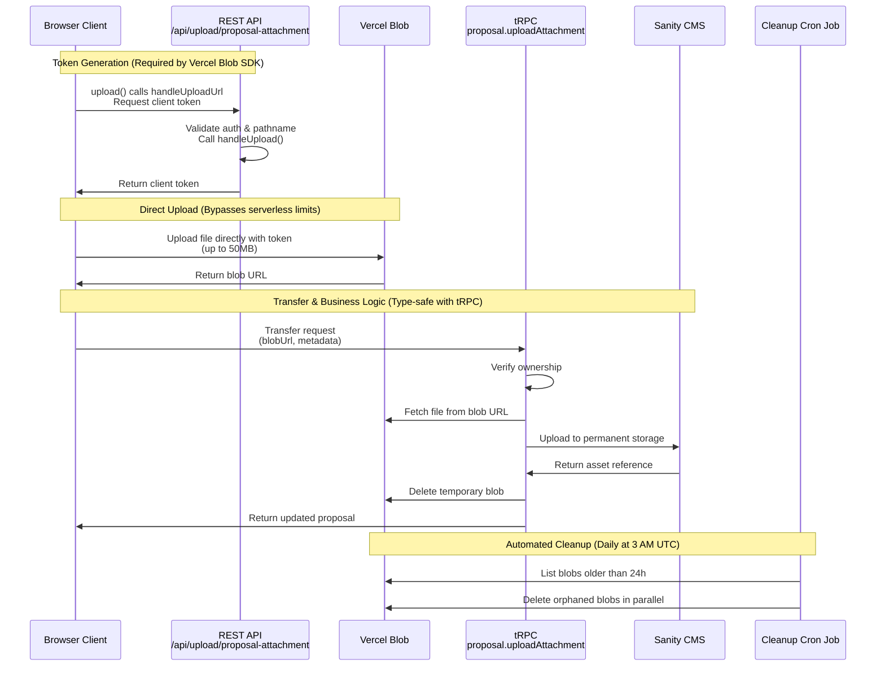

# Attachment Storage Architecture

This document describes the architecture for handling file attachments in the Cloud Native Bergen website, specifically for proposal attachments (slides, resources, recordings).

## Overview

The attachment storage system uses a **two-tier architecture** to bypass Vercel's serverless function body size limit (4.5MB) while maintaining permanent storage in Sanity CMS:

1. **Temporary Storage**: Vercel Blob (client-side direct upload)
2. **Permanent Storage**: Sanity CMS (asset management)

## Architecture Flow



**Key Architectural Decisions:**

1. **REST API for Token Generation**: Required by Vercel Blob's `upload()` function - cannot be replaced with tRPC
2. **Direct Client Upload**: Bypasses 4.5MB serverless function body limit
3. **tRPC for Business Logic**: Provides type safety for ownership verification and data transfer
4. **Immediate Cleanup**: Blobs deleted right after Sanity upload succeeds
5. **Automated Fallback**: Cron job cleans up any orphaned blobs after 24 hours

## Components

### 1. Client-Side Upload (`AttachmentManager.tsx`)

**Location**: `src/components/proposal/AttachmentManager.tsx`

**Responsibilities**:

- File validation (type, size)
- Direct upload to Vercel Blob using `@vercel/blob/client`
- Calling tRPC endpoint for Blob→Sanity transfer
- UI state management (progress, errors)

**Key Features**:

- Client-side validation before upload
- Progress indication during upload
- Error handling with user-friendly messages
- Drag-and-drop support

**Upload Flow**:

```typescript
// Step 1: upload() calls REST API endpoint to get client token
// Step 2: upload() uses token to upload directly to Vercel Blob
const blob = await upload(pathname, selectedFile, {
  access: 'public',
  handleUploadUrl: '/api/upload/proposal-attachment', // REST API (required)
})

// Step 3: Call tRPC for business logic (type-safe)
const result = await uploadMutation.mutateAsync({
  id: proposalId,
  blobUrl: blob.url,
  filename: selectedFile.name,
  attachmentType,
  title,
  description,
})
```

**Why Two API Calls?**

1. **First call** (`upload()` → REST API): Token generation - required by Vercel Blob SDK
2. **Second call** (tRPC mutation): Business logic with type safety - ownership verification, Blob→Sanity transfer

### 2. Upload Token Handler (`/api/upload/proposal-attachment`)

**Location**: `src/app/api/upload/proposal-attachment/route.ts`

**Type**: REST API Route (Required by Vercel Blob architecture)

**Why REST API instead of tRPC?**

This endpoint **must** be a REST API route because it's part of Vercel Blob's client-side upload architecture:

- The `@vercel/blob/client` `upload()` function requires a `handleUploadUrl` parameter
- This URL must point to an API route that uses `handleUpload()` from `@vercel/blob/client`
- `handleUpload()` is designed to work with Next.js Request/Response objects
- The client-side `upload()` function expects a standard HTTP endpoint for token generation

**Responsibilities**:

- Authentication verification (NextAuth)
- **Proposal ownership verification** (before token generation)
- Upload token generation (via `handleUpload()`)
- File type and size validation
- Pathname format validation

**Security (Defense in Depth)**:

- **Layer 1 - Authentication**: Requires authenticated user (NextAuth)
- **Layer 2 - Authorization**: Verifies proposal ownership BEFORE generating token
  - Calls `getProposal()` with user's speakerId
  - Rejects token generation if user doesn't own/have access to proposal
- **Layer 3 - Validation**:
  - Validates pathname format: `proposal-{id}-{timestamp}-{filename}`
  - Restricts file types to: PDF, PPTX, PPT, ODP, KEY
  - Maximum file size: 50MB
- **Layer 4 - Token Payload**: Includes proposalId and speakerId for verification
- **Layer 5 - Business Logic**: Additional ownership verification in tRPC endpoint (`proposal.uploadAttachment`)

**Key Features**:

- No file data passes through serverless function
- Returns client token for direct Blob upload
- Minimal logic - only token generation
- Request body validation
- Ownership verification deferred to tRPC endpoint

### 3. Transfer Handler (tRPC)

**Location**: `src/server/routers/proposal.ts` - `proposal.uploadAttachment`

**Responsibilities**:

- Proposal ownership verification
- Fetching file from Vercel Blob
- Uploading to Sanity CMS
- Immediate blob cleanup
- Updating proposal with new attachment

**Error Handling**:

- Validates proposal exists and user has access
- Attempts cleanup even on transfer failure
- Provides detailed error messages
- Returns updated proposal on success

**Code Example**:

```typescript
const { asset, error } = await transferBlobToSanity(
  input.blobUrl,
  input.filename,
)

if (error || !asset) {
  throw new TRPCError({
    code: 'INTERNAL_SERVER_ERROR',
    message: 'Failed to transfer file to permanent storage',
  })
}
```

### 4. Blob Utilities

**Location**: `src/lib/attachment/blob.ts`

**Functions**:

#### `transferBlobToSanity(blobUrl, filename)`

Transfers a file from Vercel Blob to Sanity and deletes the temporary blob.

**Process**:

1. Fetch file from Vercel Blob
2. Convert to File object
3. Upload to Sanity CMS
4. Delete temporary blob
5. Return asset reference or error

**Error Recovery**:

- Attempts blob cleanup even on failure
- Logs errors for monitoring
- Returns structured result object

#### `cleanupOrphanedBlob(blobUrl)`

Safely deletes an orphaned blob from Vercel Blob storage.

**Use Case**: Called by cleanup cron job for blobs that weren't properly cleaned up during upload process.

### 5. Cleanup Cron Job

**Location**: `src/app/api/cron/cleanup-orphaned-blobs/route.ts`

**Schedule**: Daily at 3:00 AM UTC (configured in `vercel.json`)

**Responsibilities**:

- List all blobs with `proposal-` prefix
- Identify blobs older than 24 hours
- Delete orphaned blobs in parallel
- Report cleanup statistics

**Security**:

- Protected by `CRON_SECRET` Bearer token
- Only accessible via Vercel Cron
- Validates environment configuration

**Monitoring**:

```json
{
  "success": true,
  "cleaned": 5,
  "failed": 0,
  "total": 5
}
```

## Configuration

### Environment Variables

**Required**:

- `BLOB_READ_WRITE_TOKEN` - Auto-created by Vercel when Blob store is created
- `CRON_SECRET` - Authentication token for cron jobs

**Vercel Configuration** (`vercel.json`):

```json
{
  "crons": [
    {
      "path": "/api/cron/cleanup-orphaned-blobs",
      "schedule": "0 3 * * *"
    }
  ],
  "functions": {}
}
```

### Next.js Configuration

**Remote Image Patterns** (`next.config.ts`):

```typescript
images: {
  remotePatterns: [
    {
      protocol: 'https',
      hostname: '*.public.blob.vercel-storage.com',
    },
  ],
}
```

### Attachment Configuration

**Location**: `src/lib/attachment/config.ts`

```typescript
export const AttachmentConfig = {
  maxFileSize: 50 * 1024 * 1024, // 50MB (via Vercel Blob)
  allowedTypes: ['pdf', 'pptx', 'ppt', 'odp', 'key'],
  allowedMimeTypes: [
    'application/pdf',
    'application/vnd.ms-powerpoint',
    'application/vnd.openxmlformats-officedocument.presentationml.presentation',
    'application/vnd.oasis.opendocument.presentation',
    'application/x-iwork-keynote-sffkey',
  ],
  timeouts: {
    fileUpload: 300000, // 5 minutes
  },
}
```

## File Naming Convention

All blobs follow this naming pattern:

```
proposal-{proposalId}-{timestamp}-{sanitizedFilename}
```

**Example**:

```
proposal-abc123-1730736000000-presentation_slides.pdf
```

**Benefits**:

- Easy identification of orphaned blobs
- Proposal association for debugging
- Timestamp for age calculation
- Unique filenames prevent collisions

## Error Handling

### Client-Side Errors

1. **File Validation Errors**:
   - Invalid file type
   - File too large (>50MB)
   - Display user-friendly message

2. **Upload Errors**:
   - Blob upload failure
   - Network issues
   - Display error message, allow retry

3. **Transfer Errors**:
   - Sanity upload failure
   - Permission denied
   - Log orphaned blob URL for cleanup

### Server-Side Errors

1. **Token Generation Errors**:
   - Invalid pathname format
   - Missing authentication
   - Return 400 with specific error message

2. **Transfer Errors**:
   - Blob fetch failure
   - Sanity upload failure
   - Attempt cleanup, return structured error

3. **Cron Job Errors**:
   - Missing CRON_SECRET
   - Blob listing failure
   - Log errors, return partial success

## Monitoring & Debugging

### Logging

All components log important events:

**Client**:

```typescript
console.log('File uploaded to Blob:', blob.url)
console.log('File transferred to Sanity:', result.asset._id)
console.error('Upload error:', err)
```

**Server**:

```typescript
console.log(`Uploading to Blob: ${blobPathname} (${sizeKB}KB)`)
console.log(`Successfully deleted temporary blob: ${blobUrl}`)
console.error('Failed to delete file asset:', error)
```

**Cron**:

```typescript
console.log(
  `Found ${blobs.length} total blobs, ${orphanedBlobs.length} orphaned`,
)
console.log(`Successfully cleaned up ${successCount} orphaned blobs`)
```

### Vercel Dashboard

Monitor blob storage usage:

1. Go to Vercel Dashboard → Project → Storage → Blob
2. View blob list and usage statistics
3. Check for orphaned blobs (should be minimal due to immediate cleanup)

### Testing Cron Job Manually

```bash
curl -X GET "https://your-domain.com/api/cron/cleanup-orphaned-blobs" \
  -H "Authorization: Bearer ${CRON_SECRET}"
```

## Cost Considerations

### Vercel Blob Pricing

**Storage**: Pay for what you use

- Temporary storage cost: ~$0.15/GB/month
- Average file size: ~5MB
- Average blob lifetime: <1 minute (immediate cleanup)
- **Expected cost**: $0.01-$0.10/month

**Bandwidth**: Pay for downloads

- Transfer to Sanity counts as download
- One-time transfer per file
- **Expected cost**: Minimal (covered by free tier)

### Sanity Pricing

**Asset Storage**: Included in plan

- Permanent storage for attachments
- No bandwidth charges for assets
- **Cost**: Part of existing Sanity subscription

## Deployment Setup

### 1. Create Vercel Blob Store

1. Go to Vercel Dashboard → Your Project → Storage
2. Click "Create Database" → Select "Blob"
3. Name: `proposal-attachments` (or similar)
4. Select environments: Development, Preview, Production
5. Click "Create"

This automatically creates `BLOB_READ_WRITE_TOKEN` in all environments.

### 2. Pull Environment Variables

```bash
npx vercel env pull .env.local
```

This downloads `BLOB_READ_WRITE_TOKEN` for local development.

### 3. Verify Cron Job Configuration

Ensure `CRON_SECRET` is set in Vercel project settings:

```bash
npx vercel env add CRON_SECRET
```

### 4. Deploy

```bash
npx vercel --prod
```

### 5. Verify Cron Job

Wait for next scheduled run (3 AM UTC) or trigger manually to verify:

```bash
curl -X GET "https://your-domain.com/api/cron/cleanup-orphaned-blobs" \
  -H "Authorization: Bearer ${CRON_SECRET}"
```

## Testing

### Local Testing

1. **Start Development Server**:

   ```bash
   pnpm run dev
   ```

2. **Test File Upload**:
   - Navigate to a proposal
   - Upload file <4.5MB (should work)
   - Upload file >4.5MB (should work via Blob)
   - Check terminal logs for blob operations

3. **Test Cron Job**:
   ```bash
   curl -X GET "http://localhost:3000/api/cron/cleanup-orphaned-blobs" \
     -H "Authorization: Bearer ${CRON_SECRET}"
   ```

### Production Testing

1. **Small File (<4.5MB)**:
   - Upload should complete quickly
   - Check Vercel Blob dashboard (should show temporary blob, then disappear)

2. **Large File (>4.5MB, <50MB)**:
   - Upload should complete successfully
   - Check Sanity Studio for attachment
   - Verify blob was deleted from Vercel Blob

3. **Error Cases**:
   - Try invalid file type (should reject)
   - Try file >50MB (should reject)
   - Try uploading to someone else's proposal (should reject)

## Troubleshooting

### Upload Fails with "File upload service is not configured"

**Cause**: `BLOB_READ_WRITE_TOKEN` is missing

**Solution**:

```bash
npx vercel env pull .env.local
# Restart dev server
pnpm run dev
```

### Blob not deleted after upload

**Cause**: Cleanup failed in `transferBlobToSanity`

**Impact**: Minimal - cron job will clean up within 24 hours

**Check**:

1. View Vercel Blob dashboard
2. Look for blobs with `proposal-` prefix
3. If >24 hours old, cron job should remove them

### Cron job not running

**Cause**: Missing or incorrect `CRON_SECRET`

**Solution**:

1. Verify `CRON_SECRET` in Vercel project settings
2. Check Vercel Logs → Cron Jobs
3. Manually trigger to test

## Migration from Old System

The previous system uploaded files directly through serverless functions, hitting the 4.5MB limit. No migration is needed:

- Old attachments remain in Sanity (unchanged)
- New uploads use Blob → Sanity flow
- All attachments display the same way
- No breaking changes for users

## Future Improvements

1. **Progress Indicator**: Show upload progress percentage
2. **Retry Logic**: Automatic retry on transient failures
3. **Batch Upload**: Support multiple file uploads at once
4. **Compression**: Automatic compression for large files
5. **Metrics**: Track upload success rates and times
6. **Admin Dashboard**: View orphaned blobs and manually clean up

## Related Documentation

- [Vercel Blob Documentation](https://vercel.com/docs/storage/vercel-blob)
- [Sanity Asset Management](https://www.sanity.io/docs/assets)
- [tRPC Documentation](https://trpc.io/)
- `/docs/TRPC_SERVER_ARCHITECTURE.md` - tRPC patterns used in this project
- `/docs/VERCEL_BLOB_INTEGRATION.md` - Detailed implementation guide
