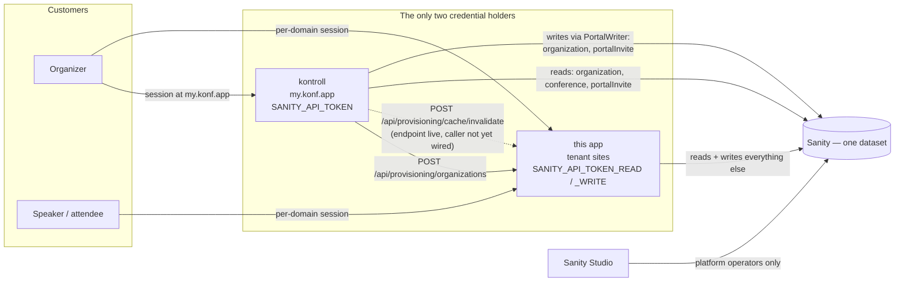

# The Control Model — this app, kontroll, and one Sanity dataset

Two applications share one Sanity dataset:

- **this repository** (`CloudNativeBergen/website`, public) serves the tenant
  conference sites and owns everything about **running** a conference;
- **`RunKonf/kontroll`** (private) is the customer control panel at
  `my.konf.app` and owns the **organization relationship** — invites, membership,
  organization settings, and the request to create a tenant.

Tenancy is a reference, not a dataset: every tenant document points at an
[`organization`](./ORGANIZATION_TIER.md), and a second Sanity dataset was priced
and rejected. So the isolation between customers is entirely a property of our
own code, and that is what this document is about.

**The constraint everything below follows from: an organization never gets
direct access to Sanity.** No customer holds a Sanity token, has a Studio seat,
or is a member of the Sanity project. Every change a customer can make to their
own content passes through one of these two applications and through that
application's authorization layer. Neither app mounts a Studio route; the Studio
is deployed to Sanity (`pnpm sanity deploy`) and reachable only by platform
operators.

That constraint is what makes the rest affordable. Because no third party holds
a credential, the boundary between the two apps can be enforced **in process**
rather than at the credential — and because it is enforced in process, it has to
be written down, or the next refactor removes it.

## Who may write what

**Reads are not partitioned; writes are.** Both applications read the dataset
directly and freely — kontroll lists a customer's conference editions straight
out of Sanity rather than asking this app for them. Only the write side is
divided, and the division is by **lifecycle stage**: kontroll owns the org
relationship and the request to provision; this app owns everything about
running the event.

| Document type                                                                | Written by                                                  | Read by       | Cached by this app                             |
| ---------------------------------------------------------------------------- | ----------------------------------------------------------- | ------------- | ---------------------------------------------- |
| `organization`                                                               | kontroll (settings patch) **and** this app (creation, plan) | both          | `getOrganizationById` — `'use cache'`, `hours` |
| `conference`                                                                 | this app only                                               | both          | `fetchConferenceData` — `'use cache'`, `hours` |
| `portalInvite`                                                               | kontroll only                                               | kontroll only | no                                             |
| `portalRateLimit`                                                            | kontroll only — allowlisted, but nothing writes it yet      | nobody        | no                                             |
| `speaker`, `domainVerification`                                              | this app only                                               | this app only | per-surface                                    |
| `provisioningRequest`, `provisioningRateLimit`                               | this app only                                               | this app only | no                                             |
| everything else (talk, proposal, schedule, sponsor, review, notification, …) | this app only                                               | this app only | per-page, `conferenceTag`                      |

The one type both applications write is `organization`, and it is the reason
the whole cache-coherence section below exists.

### The partition rule in force

A sharper candidate rule was proposed while this was being designed —
_kontroll writes only documents this app never reads_ — because it is checkable
rather than a judgement call. **It is not the rule, and it cannot be adopted
without redesigning the product.** kontroll's whole job is letting a customer
edit their own organization: name, slug, contact address. Those fields are read
by this app on every tenant page. A rule that forbids the overlap forbids
self-service.

So the rule is the lifecycle split above, made checkable a different way: not by
a property of the document graph, but by a **literal allowlist with a test
behind it** in kontroll (`src/lib/sanity/partition.ts`). The candidate rule
traded a judgement call for a graph property; the allowlist trades it for an
enumeration, which is the same win at a place we control.

The cost of the overlap is a cache-coherence problem, and the invalidation
endpoint is the design response to it.

The lifecycle split is a settled decision, not a working assumption. Its
enforcement is meant to be an **operation × type** allowlist — `organization`
permits `patch` and nothing else — rather than the type-only allowlist that
exists today. That gap is real and is described below; `RunKonf/kontroll#2`
tracks closing it.

### kontroll's choke point

Every kontroll mutation goes through one class, `PortalWriter`
(`src/lib/sanity/write.ts`), over a deliberately narrow interface: `create`,
`createOrReplace`, `patch(id, spec)`, `delete(id)`. Sanity's `{ query }` forms of
patch and delete are not on the interface at all, so kontroll cannot express a
mutation that selects its own targets.

The allowlist is exactly three `_type` values: `organization`, `portalInvite`,
`portalRateLimit`. `conference` is absent, and a seam test asserts that it is.
The check runs on all four methods. For `patch` and `delete` the caller supplies
no type, so the writer **reads the type out of the lake first** and refuses an id
that resolves to nothing — an unresolvable id is refused rather than assumed
safe. A refusal issues no Sanity **mutation**, which is what the tests assert —
and the distinction matters: `create` and `createOrReplace` are refused without
the client being touched at all, while a refused `patch` or `delete` has already
cost one read, the type probe itself (`*[_id == $id][0]._type`,
`src/lib/sanity/write.ts:180`).

The write client is module-private and reachable only through the writer.
kontroll closes the two ways around that with ESLint: a `no-restricted-imports`
**pattern** (not path — `@sanity/client/stega` also exports `createClient`) and
a `no-restricted-syntax` selector on `ImportExpression`, because
`no-restricted-imports` does not inspect dynamic `import()` at all. Both
bypasses are exercised against the real config in a test.

**Where this control is partial, and it matters:**

- **The allowlist is per type, not per field.** The doctrine is that kontroll
  writes organization _settings_ and never creates or deletes an organization —
  and today the single call site patches exactly four fields (`name`, `slug`,
  `contactEmail`, `billingEmail`). But that is a property of the call site, not
  of the guard: `create`, `createOrReplace` and `delete` on an `organization`
  all pass the allowlist. The writer's own tests assert that `create` and
  `createOrReplace` succeed on an `organization`; the delete-succeeds test
  targets a `portalInvite`, so organization deletion is permitted by the same
  type check rather than separately demonstrated.
  The settings-only restriction is documentation. The agreed shape is to
  partition on operation × type so that `organization` permits `patch` alone,
  and to invert those tests so they assert the refusals — tracked at
  `RunKonf/kontroll#2`.
- **`portalRateLimit` is allowlisted with no code behind it** — a live write
  grant for a feature that does not exist.
- **Neither Sanity credential is scoped by document type.** kontroll uses a
  single `SANITY_API_TOKEN` for both its reads and its writes, and Sanity does
  not restrict it to the three allowlisted types. The partition is
  code checking itself. A bug in kontroll, or a leak of its token, writes
  anything in the dataset. That is the accepted residual risk of one shared
  dataset, and it is the thing the allowlist reduces rather than removes.

### This app's own writes

This app is the owner, so it is not choked the same way. `clientWrite`
(`src/lib/sanity/client.ts`, token `SANITY_API_TOKEN_WRITE`) is imported directly
by dozens of modules across `src/`, and no lint rule restricts it. What
constrains a write here is the **tRPC waist**, not the client:

- the conference is resolved from the request `Host`, never from a client
  parameter (`resolveConferenceId()`);
- any client-supplied document id is checked for tenant ownership by
  `src/server/tenancy.ts` (`requireDocumentInCurrentConference`,
  `requireSpeakerInCurrentOrg`, and siblings), which fails closed everywhere —
  an unreadable document is treated as one we do not own.

`src/server/tenancy.ts` says in its own header what it does not cover: anything
holding a Sanity credential bypasses it entirely. kontroll is exactly that
position, which is why kontroll needs a choke point of its own and this app does
not.

## The machine boundary

kontroll reaches this app over HTTP at two endpoints. Nothing goes the other
way — this app never calls kontroll.

| Endpoint                                  | Purpose                        | Idempotency                                    |
| ----------------------------------------- | ------------------------------ | ---------------------------------------------- |
| `POST /api/provisioning/organizations`    | create a tenant, atomically    | key required                                   |
| `POST /api/provisioning/cache/invalidate` | bust cache entries by document | none — revalidating twice is revalidating once |

Both are documented in detail in [Machine Provisioning API](./PROVISIONING_API.md).
What follows is only the part that is about the boundary itself.

### Authentication

One shared bearer secret, `PROVISIONING_API_TOKEN`, checked by one function
(`src/lib/provisioning/token.ts`). Both endpoints use it. Invalidation is
strictly less powerful than provisioning — a holder of the secret can already
mint organizations and claim domains — so a second secret would protect nothing
while adding a rotation surface and one more variable to forget in a new
environment.

Three properties, each deliberate:

- **Fails closed on misconfiguration.** The configured secret is validated
  _before_ the request header is even read: unset, empty, whitespace-only or
  shorter than 32 characters refuses every caller. There is no code path on
  which "no secret configured" becomes "no authentication required" — that is
  the standard way an endpoint like this ships open on the day someone forgets
  an env var in a new environment.
- **Constant-time comparison over fixed-width digests.** Both sides are hashed
  to a 32-byte SHA-256 digest and compared with `timingSafeEqual`. Hashing first
  removes the length branch entirely, so neither the secret's length nor its
  bytes leak — `timingSafeEqual` throws on unequal lengths, which is itself an
  oracle if you feed it raw strings.
- **Uniform 401.** All four internal failure reasons map to one byte-identical
  response body. A prober cannot learn whether the endpoint is configured or
  whether their token shape was accepted. Opacity stops at the door: once a
  caller has proven it holds the secret, conflicts are named, because the
  control panel legitimately has to render "that slug is taken".

### Rate limiting, and why the two bounds are asymmetric

Each endpoint carries two durable limits, on Sanity documents with
revision-conditioned compare-and-swap. An in-process counter is not a limit in a
serverless deployment.

| Endpoint     | Pre-auth, per client IP   | Post-auth, global         |
| ------------ | ------------------------- | ------------------------- |
| provisioning | 10/min · 60/h · 300/day   | 5/min · 30/h · 100/day    |
| invalidation | 60/min · 600/h · 3000/day | 60/min · 600/h · 5000/day |

The asymmetry is the point, and it is easy to "fix" wrongly.

**The pre-auth bound is per IP because a global pre-auth bound is an
unauthenticated denial-of-service lever.** Anything charged before the token is
compared can be charged by anyone. If that bucket were global, one unauthorized
caller sending cheap junk could exhaust it and lock kontroll out of the only
path to tenant creation — the attacker would not need the secret, only a socket.
Keying it per IP means an attacker spends their own budget, not the platform's.

**The post-auth bound is global because the per-IP key is caller-controlled.**
`x-forwarded-for` is a header; anyone can rotate it, and a routed IPv6 /64
supplies as many distinct addresses as anyone needs. A per-IP bound on the
expensive operation would therefore bound nothing. The global bucket is charged
only after authentication, so it cannot be reached without the secret, and it is
what actually caps bulk tenant minting if the secret leaks. Provisioning is
charged after validation as well — a malformed payload must not consume the
platform's tenant-creation budget.

So: the per-IP bucket meters guessing, the global bucket meters use, and neither
one could do the other's job. Both fail closed in every direction — no salt, an
unreadable bucket, an unpersistable hit all deny. (The email sign-in limiter
deliberately fails _open_, because locking everyone out of sign-in is worse than
an absent cap. Here the guarded operation is a rare privileged write, so
refusing during an outage costs a retry and nothing else.)

Invalidation is additionally bounded per call at 20 targets, which is what caps
the work one accepted request can cause: at most 1,200 tag revalidations a
minute platform-wide.

### What the invalidation endpoint deliberately cannot do

The caller names **documents, never tags**. Which cache tag an
`{"type":"organization","id":…}` implies is this app's decision, made in
`src/lib/cache/invalidation.ts` by delegating to the same builders the cached
reads use. Two consequences are load-bearing:

- **There is no blanket flush.** The broad `content:*` tags — the ones that bust
  every tenant at once — are not in the vocabulary and cannot be spelled into
  existence; the document-id pattern rejects the colon they contain. An endpoint
  that exposed them would hand any holder of the secret a cache-stampede
  primitive against the whole platform.
- **It is not an existence oracle.** Nothing in that module reads Sanity. A tag
  is a pure function of the caller's input, so invalidating an organization that
  does not exist computes a tag nothing is stored under and returns the same
  `200` as a real hit.

## Cache coherence

This app serves tenant pages from Next's `'use cache'`. Two of those cached
reads are over documents the other application can change:

- `getOrganizationById` (`src/lib/organization/sanity.ts`) — `cacheLife('hours')`
  over `name`, `slug`, `contactEmail`, `plan`, `featureOverrides`. The first
  three are **exactly the overlap** between this projection and what kontroll
  writes when an organizer edits their organization — the settings patch sets
  those three plus `billingEmail`, a fourth field this cache never serves. So
  the overlap is what can go stale; the fourth field simply is not read here.
- `fetchConferenceData` (`src/lib/conference/sanity.ts`) — entered by `Host`, so
  it registers `domainTag(domain)` on the way in and `conferenceTag(_id)` once
  the fetch has told it which conference that host resolves to. That is why the
  invalidation vocabulary has both a `conference` and a `domain` member: a
  caller that knows only the hostname can still bust the entry.

`cacheLife('hours')` is Next's built-in profile — this repo defines no custom
profiles — and its documented expiry is 24 hours. Nothing in this repo asserts
Next's numbers; that is Next's contract, not ours. What matters is the shape:
without an external invalidation path, an organizer renames their organization
in kontroll, sees a success message, and their conference site keeps serving the
old value for the better part of a day. Both applications behave exactly as
written, which is what makes it miserable to diagnose.

Tag strings are minted in exactly one place, `src/lib/cache/tags.ts`
(`sanity:conference-<id>`, `sanity:organization-<id>`, `domain:<host>`), and
both the reads and the invalidation path import from it. A second spelling of a
tag is the silent failure this whole feature exists to prevent, so the coherence
test pins the only thing that can actually break: that the tag the read
registers and the tag the endpoint revalidates are the same string.

**Grants are deliberately not on this path.** `org.slug` is an authorization
input — platform-operator standing is derived from it — and a revocation that
waits on a caller remembering to call an endpoint is not a revocation. So the
platform-org check reads uncached, from a single resolver (`getPlatformOrgId()`
in `src/lib/authz/platform.ts`), and every gate compares ids against it. The
cost is one indexed point lookup per gate evaluation. The invalidation endpoint
is for content; `plan` and `featureOverrides` stay on the cached read and are
tag-invalidated — today only by this app's own mutations, because nothing in
kontroll calls the endpoint yet (see "Known, and not designed for").

## Tenant scoping

Scoping is enforced the same way in both repositories and is documented in full
in [Tenant-Scoped Query Invariant](./TENANT_SCOPING.md). Three things belong
here because they are properties of the boundary rather than of one app:

**The builder fails closed.** `scopedFetch` (`src/lib/sanity/scoped.ts`)
prepends `conference._ref == $conferenceId` / `organization._ref == $orgId` into
the root filter and binds the parameter, so the tenant is named once. A scope
with **no** resolvable dimension throws rather than widening to a global read.
(A _partially_ resolved scope narrows to the dimension it has — that is by
design and is the sharp edge; resolve the tenant in the caller.)

**Both repositories carry the lint rule, with different settings.** This app
runs `tenancy/no-unscoped-groq` at `warn`, because roughly 230 pre-existing
unscoped queries would otherwise block CI. kontroll runs the same rule at
`error` — it has ten root filters in total, so it can afford to. kontroll's
notion of "scoped" is also different: it has no runtime builder, so scope means
an explicit `$orgId`/`$orgIds` parameter, plus an **identity** axis (`$userKey`)
this app has no equivalent of, because invite redemption happens before any
organization exists.

**The rule is a net, not a proof, and the holes are named.** It is a syntactic
match on the first token after a root filter's `[`, not a GROQ parser. Predicate
reorder (`*[defined(foo) && _type == "x"]`), reversed comparison, `_id in $ids`,
`references()`, `slug.current`, nested roots inside a projection, and a filter
built by string concatenation all run across every tenant and are reported
clean. Those blind spots hide two populations, and **only one of them has been
assessed**:

- the **flat** shapes — a root filter the pattern cannot match. A live census
  names the nine such sites in `src/` and assesses each; none is dangerous
  today.
- **nested roots inside a projection**, which the census deliberately excludes.
  **26 literals in `src/` carry 37 nested root filters the rule never examines**,
  and auditing all 37 was explicitly out of scope for the change that measured
  them (#676). None of them has been assessed for danger; the count is pinned by
  a characterization test so a future fix flips a documented expectation.

So "none dangerous today" is established for nine of roughly forty-six
rule-invisible sites, and even there it is a statement about the current call
graph, not about the rule. Both populations are described in full in
`eslint-rules/no-unscoped-groq.js` and in
[Tenant-Scoped Query Invariant](./TENANT_SCOPING.md) ("Nested roots, in detail").
Issue #792 tracks closing them, and the honest fix is to parse rather than
pattern-match — `groq-js` is already a dependency.

One further limit, stated in `src/lib/sanity/scoped.ts` itself: scoping is a
**correctness** invariant, not a security boundary. It keeps one tenant's data
out of another tenant's lists. It does not stop a holder of a Sanity
credential — the Studio, a `scripts/**` job, kontroll — from reading across
tenants. This app's lint rule additionally exempts paths that run with a write
token (`scripts/`, `migrations/`) and says so as a known gap. kontroll's copy
does not: it allowlists test files only, has neither directory, and exempts
nothing under `src/` — including the write choke point, whose global type probe
carries an ordinary `groq-global:` annotation like any other cross-tenant read.

## Schema drift control

kontroll reads `conference` and reads and writes `organization` straight out of
Sanity, and it does not compile against this repository. So a field this repo
deletes or retypes does not break kontroll's build; it makes kontroll return
`undefined` in production, silently, against live content. The type system
cannot see across the gap, so a test stands in for it.

**Both types are locked append-only.** `sanity/schema-shape.baseline.json` is a
committed snapshot of flattened field paths to type names for `conference` and
`organization`; `__tests__/sanity/schema-contract.test.ts` diffs the live schema
against it. Adding a field passes, always. Removing fails. Retyping fails.
Renaming is a removal plus an addition and fails on the removal. The walker
follows nested objects, arrays and separately-registered types, so a rich-text
sub-field is inside the lock too. The lock is itself tested for falsifiability —
there are tests that assert the diff detects each kind of drift, and one that
asserts the failure message still says what to do about it.

**The escape hatch is deliberate, not an accident:** if a removal is genuinely
intended, run `pnpm tsx scripts/update-schema-baseline.ts` and commit the
regenerated baseline **in the same PR**, after making kontroll stop reading the
field. The lock exists to make that a decision rather than a surprise.

**On top of the lock sits a much narrower contract.** `conference` carries some
eighty top-level fields; kontroll depends on nine of them.
`src/lib/conference/contract.ts` is the one place that says which nine, plus the
GROQ projection kontroll runs, and the schema test asserts every one of the nine
still exists with its own failure message. The module is deliberately
standalone — no app imports, no Sanity client, no Next.js — so it can be lifted
verbatim into a shared `@runkonf/core` package. Public-to-private consumption
needs no visibility change, so nothing blocks that but the work.

Today it is not shared: kontroll holds **verbatim copies** of that file, of the
provisioning request schema, and of the domain helpers, each marked with the
commit it was copied at. kontroll derives its request type from the copied Zod
schema, so a widened or tightened field is a compile error there — but only
_after_ a human re-copies. Nothing detects that this repository changed.

## Failure modes

### Designed for

| Failure                                                 | What happens                                                                                                                                                                                                       |
| ------------------------------------------------------- | ------------------------------------------------------------------------------------------------------------------------------------------------------------------------------------------------------------------ |
| `PROVISIONING_API_TOKEN` unset, empty or under 32 chars | Both endpoints refuse every caller with the uniform 401. Never "open because unconfigured".                                                                                                                        |
| Someone guesses at the secret                           | Per-IP pre-auth bucket, charged before the comparison. Uniform 401 tells them nothing about progress.                                                                                                              |
| The secret leaks                                        | Global post-auth bucket caps tenant creation at 5/min, 100/day. Invalidation cannot name a broad tag.                                                                                                              |
| kontroll's provisioning call times out and is retried   | The idempotency receipt is created inside the same transaction, so a replay returns the original ids and writes nothing. The key is minted once, at invite time, and stored on the invite.                         |
| The rate limiter itself is unavailable                  | Denies — no salt, unreadable bucket and unpersistable hit all fail closed. An unmetered privileged write is worse than a refused one.                                                                              |
| kontroll is asked to write a document this app owns     | `PortalWriter` refuses before issuing any Sanity **mutation**. `create`/`createOrReplace` never touch the client; `patch`/`delete` cost one read — the type probe — so a mislabelled or unknown id is refused too. |
| A field kontroll reads is removed or retyped here       | The append-only lock fails CI, with a message naming the field and the escape hatch.                                                                                                                               |
| A tenant-scoped read cannot resolve its tenant          | `scopedFetch` throws; the tRPC ownership guards return not-found. Both fail closed.                                                                                                                                |
| Platform-operator standing is revoked                   | Takes effect immediately — that read is uncached by design and derived in exactly one place.                                                                                                                       |
| **kontroll is down**                                    | Tenant sites are unaffected; they read Sanity directly. No new tenants, invites, or organization-settings edits until it is back.                                                                                  |
| **This app is unreachable from kontroll**               | The provisioning POST fails on a 20-second timeout and surfaces a retryable error to the operator. kontroll's own write happens only _after_ a success, so nothing is half-written on its side.                    |
| **Sanity is down**                                      | Both applications are down. The provisioning endpoints refuse rather than run unmetered, because the limiter fails closed.                                                                                         |

### Known, and not designed for

Listed because a gap someone can find in the code and not in the doc is worse
than no doc.

- **Nothing calls the invalidation endpoint yet.** The endpoint is live, tested
  and documented; kontroll has no call to it and no environment variable for it.
  So the staleness the endpoint exists to fix is still live: an organization
  rename or slug change in kontroll is not reflected on the tenant site until
  the cache entry expires on its own. Wiring it is one POST after each
  `organization` write, with the token kontroll already holds.
- **Slug and domain uniqueness are read-then-write, not constraints.** Two
  provisioning requests with _different_ idempotency keys, racing on the same
  slug, can both pass the check and both commit; the receipt is keyed on the
  request, not the slug. Narrow today — the only caller provisions on human
  action — and wider the moment provisioning is automated. A domain collision is
  worse than a slug collision, because it is a routing conflict between tenants.
  Tracked as #777; the fix is to derive the organization `_id` from the slug so
  Sanity's create-CAS enforces uniqueness.
- **Pre-auth rate-limit buckets are documents an unauthenticated caller can
  create**, one per client IP, and the IP is caller-controlled. This makes the
  per-IP attempt cap evadable by rotation (the global post-auth bucket is the
  bound that survives), and it makes cheap unauthenticated traffic into dataset
  writes — enough of them would exhaust the document quota, at which point
  writes break for every tenant. Tracked as #776, whose proposed fix — a coarse
  global bucket charged before the per-IP one — is in tension with the reason
  the pre-auth bound is per IP in the first place. It is only safe if it is
  sized as a bound on **document creation** rather than on access: large enough
  that legitimate provisioning traffic can never approach it, since anything
  charged pre-auth can be charged by anyone.
- **kontroll's write partition is per type, not per field**, and `organization`
  create and delete pass it even though the doctrine is settings-only.
  `portalRateLimit` is allowlisted with nothing behind it.
- **The copied contract files have no CI check.** Drift between the two repos is
  caught by a compile error in kontroll _after_ someone re-copies; nothing
  notices that this repository moved. A published `@runkonf/core` removes the
  category; a fetch-and-diff job in kontroll's CI would close it sooner.
- **A provisioning success followed by a kontroll write failure strands the
  membership.** `attachProvisionedOrganization` runs after the HTTP call
  returns; if that patch fails, the tenant exists here and the customer's invite
  is not bound to it. The invite stays pending and a retry replays the same
  idempotency key, so recovery is a resubmit — but nothing detects the state.
- **The lint rule's remaining blind spots** (#792), and the `scripts/**` and
  Studio exemptions, are described above and in
  [Tenant-Scoped Query Invariant](./TENANT_SCOPING.md).
