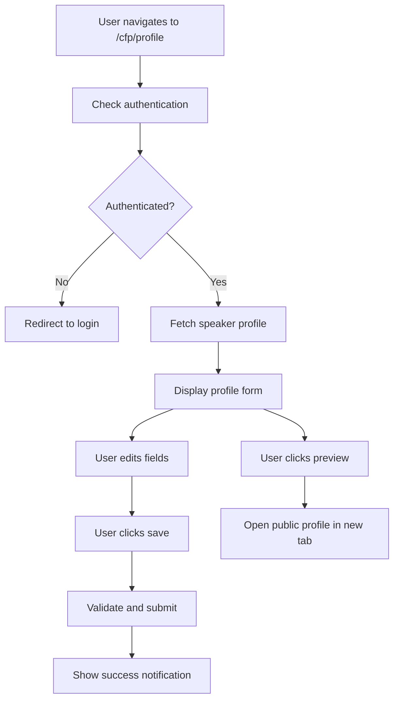

# Speaker Profile Management Plan

## Overview

Create a private speaker profile management page at `/cfp/profile` where authenticated speakers can view and edit their own profile information.

## Todo List

1. [ ] Create the main profile page at src/app/(main)/cfp/profile/page.tsx
   - Build the main page component that orchestrates all profile features
   - Fetch speaker data using authentication context
   - Handle overall page layout and state management

2. [ ] Create a SpeakerProfileForm component for editing speaker details
   - Handle editing of name, title, bio, and speaker flags
   - Include form validation based on existing validation rules
   - Integrate with the profile API endpoint

3. [ ] Create a ProfileImageUpload component for handling profile picture uploads
   - Allow speakers to upload and preview their profile image
   - Integrate with the existing `/api/profile/image` endpoint
   - Show current image with option to replace

4. [ ] Create a ProfileLinksManager component for managing social media links
   - Allow adding/removing social media links
   - Support various link types (LinkedIn, Twitter, GitHub, etc.)
   - Include validation for URL formats

5. [ ] Add a PublicProfilePreview button that opens the public profile in a new tab
   - Create a button component that generates the public profile URL
   - Use the speaker's slug to construct `/speaker/[slug]` URL
   - Open in a new browser tab for easy comparison
   - Consider adding a preview mode indicator

6. [ ] Add navigation link to the profile page from the CFP list page
   - Update the CFP list page to include a "Edit Profile" link
   - Make the link prominent but not intrusive
   - Consider adding it to the speaker's name/avatar area

7. [ ] Create client-side API hooks for profile management
   - Create reusable hooks for fetching and updating profile data
   - Handle loading states and error management
   - Include optimistic updates for better UX

8. [ ] Add loading and error states for better user experience
   - Show skeleton loaders during data fetching
   - Display clear error messages when operations fail
   - Include retry mechanisms for failed requests

9. [ ] Add success notifications when profile is updated
   - Show toast notifications for successful updates
   - Consider using the existing notification system if available
   - Provide clear feedback for each action

10. [ ] Display read-only email from OAuth provider
    - Show the email address from the authentication session
    - Make it clear this cannot be edited
    - Consider adding provider information (GitHub/LinkedIn)

11. [ ] Test the complete profile management flow
    - Test all CRUD operations for profile data
    - Verify image upload functionality
    - Ensure the public profile preview works correctly
    - Test with both GitHub and LinkedIn OAuth providers

## Key Features

### Editable Fields

- Name
- Title
- Bio
- Speaker flags (is_organizer, is_volunteer, etc.)
- Profile image
- Social media links

### Read-only Fields

- Email (from OAuth provider)
- Authentication provider type

### Additional Features

- Public profile preview button to see how the profile appears to attendees
- Real-time form validation
- Optimistic UI updates
- Comprehensive error handling

## Technical Considerations

- Use existing API endpoints (`/api/profile`, `/api/profile/image`)
- Leverage the speaker validation logic from `/lib/speaker/validation.ts`
- Follow the established component patterns in the codebase
- Ensure compatibility with both OAuth providers (GitHub and LinkedIn)
- Maintain consistency with the existing UI/UX patterns

## User Flow

This plan ensures speakers have full control over their profile information while maintaining the security and integrity of the authentication system.
